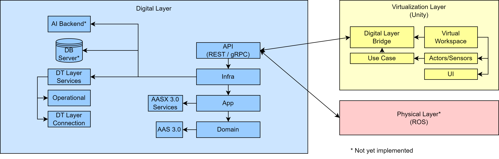

# FSRDigitalTwin3D
FSRDigitalTwin3D is a prototype of a Digital Twin Framework with the aim to be as simplistic as possible while at the same time  providing a complete prototyping enviroment for mutliple use cases mainly focused on robotic simulations.

**Disclaimer:** This framework is developed as a sub-project for the research association FORSocialRobots, namely "Subproject 4: Simulation and validation of socially cognitive robots in the digital twin"

## Requirements
This project has OS support for Linux and Windows.
- .NET 8.*
- Unity 2022.3.11f1

## Installation
1. Clone this repository
2. Init submodules: ```git submodule update --init --recursive```
3. Navigate to ```./Tools/```
    - Run ```install-tools.*```
    - Run ```install-client-plugins.*```

## Architecture


The framework consists of three main parts, that is the digital layer (Server), as well as a physical and virtual layer (Client).

### Digital layer
The digital layer acts as a server and maintains a semantic description about the provided use case combined with an Industry 4.0 standardised API for data exchange. Currently, the Asset Administration Shell V3.0 (AAS) is used to provide these services.

The internal architecture of the server follows the ["Clean Architecture"](https://betterprogramming.pub/the-clean-architecture-beginners-guide-e4b7058c1165) design pattern:

- **Domain**: Contains the AAS 3.0 models
- **App**: Implements app services (AASX services)
- **Infra**: Responsible for communication with external modules; also provides a bridge to the virtual and phyiscal layer via gRPC services
- **API**: REST and gRPC compatible API

Additional components:

- **DT Layer Services**: Manages connected layers.
- **Operational**: Handles invocation requests and responses.
- **Connection**: Establishes layer connections via gRPC

### Virtual layer

The virtual layer acts as the use case's virtualization environment. It mirrors and visualizes the physical counterpart and provides a UI for user interaction. Up to this point, this is done using the Unity game engine.

- **Digital Layer Bridge**: Connects the virtual layer client with the digital layer server. This is done using a gRPC contract.
- **Use Case**: Additional functionality specific to the use case
- **Virtual Workspace**: The virtually mirrored asset with actors and sensors. Users can interact via a provided UI.

### Physical layer

The physical layer is an interface to the real-world phyiscal assets. It behaves in the same manner as the virtual layer but forwards information and data to the corresponding assets. *Currently, a ROS interface is planned as the physical layer client.*
